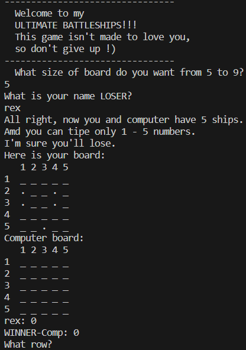

# ULTIMATE Battleships

Ultimate Battleships is a Python terminal game, which runs in the Code Institute mock terminal on Heroku

Users can try to beat the computer by finding all of the computer's battlehsips before the computer finds their. Each battleship occuries one square on the board and has a little name-calling to motivate the player to win.

[Live version.](https://python-project-3-new-3f88986e2ef3.herokuapp.com/[)

# How to play

Ultimate Battleships is based on the classic pen-and-paper game. You can read about it on [Wikipedia](https://en.wikipedia.org/wiki/Battleship_(game)).

In this variant, the player enters his name and board size so that two random boards with ships can be generated (number of ships = board size).

The player can see where their ships are, indicated by an `.` sign, but computer ships are unvisible.

Hits are marked by `X` and mistakes indicated by `O`.
## Features

#### Existing Features

- Random board generation
    - The number of Ships is generated according to the size of the field and are placed randomly throughout the field.
    - The player cannot see where the enemy ships are.

- Player against the computer
- Accepts user input
- Maintains scores and has a little name-calling to motivate the player to win.

- Input validation and error-chekcing
    - You cannot enter coordinates outside the size of the grid
    - You must enter numbers 
    - You cannot enter the same guess twice

- Data maintained in class instances

#### Future Features 

- Have ships larger than 1x1
- Allow player to position ships themselves

## Data Model

I decide to use Board, Player and Computer classes for my game. The game creates one player and a computer classes with their boards whose size is specified at the beginning of the game (from 5x5 to 9x9).

The Board class stores the board size, positions of N(5-9) ships(depends on board size), the board array. The Player and Computer classes stores guesses, apponent board and the logic of the moves (class-specific).
## Testing

I have manually tested this project by doing the following:
 - Passed the code through a PEP8 linter and confirmed there are no problems.
 - Given invalid inputs: strings when numbers are expected, out of Bounds inputs, same input twice
 - Tested in my local terminal and the Code Institute Heroku terminal

 ### Bugs

 #### Solved Bugs

- The problem is that all moves were written to the common variable move in Player class. The problem was solved by creating a separate variable for the Computer class.

- My way of navigating the map to position ships was initially bad, I tried to use a random cell number (for example in a 5 by 5 field there are 25 cells and randomly select a cell under the number 16). Fixed that the coordinates of ships are now recorded as normal coordinates in the array.

#### Remaining Bugs

- No bugs remaining.

Validator Testing

- PEP8
    - No errors were returned from PEP8online.com.

## Deployment

This project was deployed using Code Institute's mock terminal for Heroku.

- Steps for deployment:
    - Fork or clone this repository
    - Create a new Heroku app
    - Set the buildbacks to `Python` and `NodeJS` in that order
    - Link the Heroku app to the repository
    - Click on Deploy

## Credits

- Wikipedia for the details about Battleships game
- Code Institute for the deployment terminal
